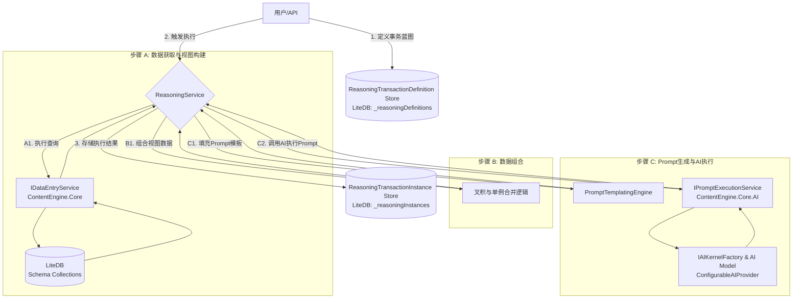
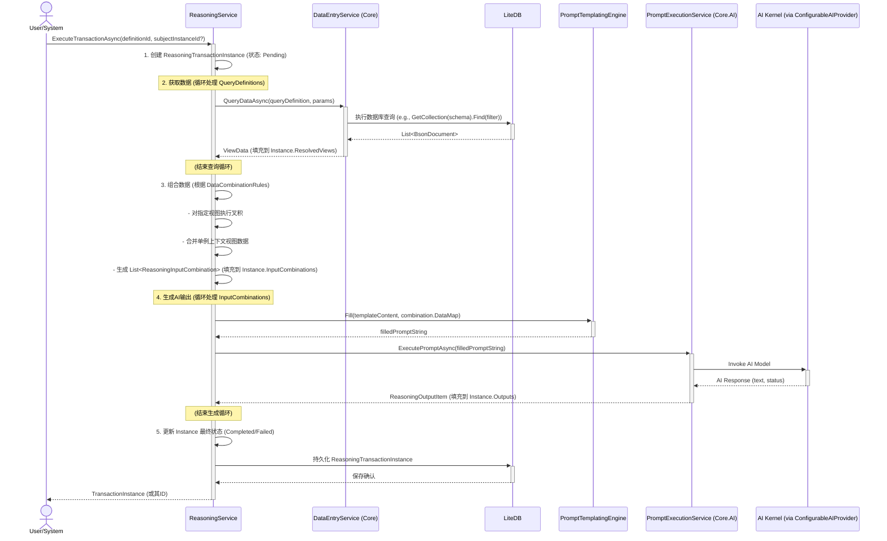
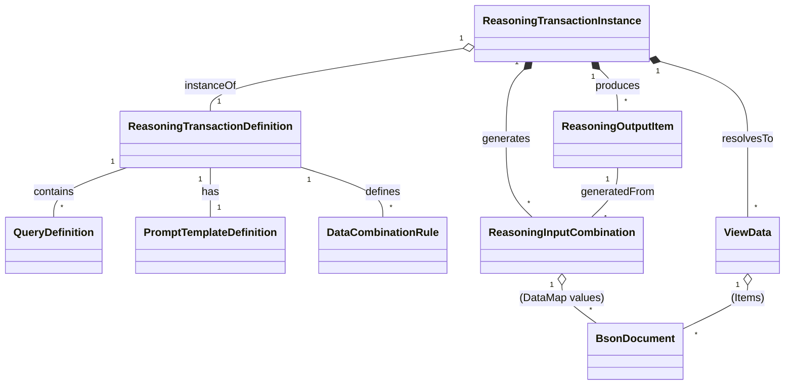

# ContentEngine - 推理引擎设计文档

## 1. 引言

本文档旨在详细阐述 ContentEngine 项目中"推理引擎"模块的设计思路。该引擎的核心目标是根据用户定义的"事务蓝图"，自动化地从现有结构化数据中提取信息、组合上下文、并通过 AI 大语言模型生成新的内容或推断。设计灵感来源于用户提出的将推理任务分解为数据准备（视图构建）、数据组合（叉积）和基于模板的 AI 调用流程。

## 2. 核心概念

推理引擎围绕以下核心概念构建：

*   **推理事务定义 (ReasoningTransactionDefinition)**:
    *   描述一类特定推理任务的静态蓝图或模板。
    *   包含：唯一的名称/ID、描述、需要执行的查询定义、数据组合规则以及一个Prompt模板。
    *   例如："为特定类型的NPC在特定情景下生成行为表现的事务定义"。

*   **推理事务实例 (ReasoningTransactionInstance)**:
    *   一次具体推理任务的动态执行过程和结果记录。
    *   包含：对事务定义的引用、执行状态（如待处理、数据获取中、生成中、完成、失败）、所有获取到的数据视图、所有输入组合以及最终的AI输出。

*   **数据视图 (View / ViewData)**:
    *   代表从一个或多个数据源（LiteDB集合）中，根据特定查询逻辑（筛选、选择字段等）提取出来的结构化数据子集。
    *   例如："符合条件的NPC信息视图"、"当前激活的场景参数视图"。
    *   每个视图由一个或多个 `BsonDocument` 条目组成。

*   **查询定义 (QueryDefinition)**:
    *   在"推理事务定义"中指定，描述如何获取数据以构建一个"数据视图"。
    *   包含：查询ID、输出视图名称、源Schema名称（LiteDB集合名）、筛选条件（如BSON表达式）、选择的字段列表。

*   **Prompt模板定义 (PromptTemplateDefinition)**:
    *   一个带有占位符的文本模板，定义了与AI交互时最终Prompt的结构。
    *   指明了如何使用来自不同"数据视图"组合后的信息来填充这些占位符。

*   **输入组合 (ReasoningInputCombination)**:
    *   根据"数据组合规则"（通常是多个数据视图的叉积操作），将来自不同视图的具体数据条目（`BsonDocument`）组合起来，形成一个准备填充到Prompt模板中的单元。
    *   例如，如果NPC视图有N个NPC，情景视图有M个情景，叉积后会产生N\*M个输入组合。每个组合包含一个NPC的 `BsonDocument` 和一个情景的 `BsonDocument`。

*   **数据组合规则 (DataCombinationRule)**:
    *   定义了如何将多个"数据视图"中的数据条目组合成"输入组合"。
    *   主要规则是"叉积"（Cross Product）：将多个视图中的每一项与其他视图的每一项配对。
    *   也支持"单例上下文视图"：某些视图可能只包含一个全局性条目，该条目会附加到每个叉积生成的组合上。

*   **生成过程 (Generation Process)**:
    *   对于每一个"输入组合"，将其包含的各视图数据填充到"Prompt模板"中，形成一个具体的、可执行的Prompt。
    *   将此具体Prompt发送给AI模型，获取输出。

*   **输出项 (ReasoningOutputItem)**:
    *   AI模型针对单个"输入组合"所生成的具体结果。
    *   包含生成的文本、成功/失败状态、错误信息（如果失败）等。整个"事务实例"会管理所有这些输出的总和。

## 3. 高层架构与数据流



## 4. 详细工作流程

### 4.1. 定义阶段

1.  用户（通过UI或API）创建一个 `ReasoningTransactionDefinition` 对象。
2.  在此定义中，用户需指定：
    *   `Name`, `Description`: 事务的元数据。
    *   `QueryDefinitions`: 一个列表，每个定义了如何获取一个数据视图（源Schema、筛选条件、选择字段、输出视图名）。
    *   `PromptTemplateDefinition`: 包含原始模板字符串和模板期望的输入视图名称。
    *   `DataCombinationRules`: 定义哪些视图需要进行叉积，哪些作为单例上下文。
3.  此 `ReasoningTransactionDefinition` 被持久化存储（例如，在LiteDB的 `_reasoningDefinitions` 集合中）。

### 4.2. 执行阶段

执行流程的参与者和交互如下：



## 5. 建议的代码结构

模块: `ContentEngine.Core.Inference` (新模块或 `ContentEngine.Core` 的子目录)

### 5.1. 模型 (Models)

存放于 `ContentEngine.Core.Inference/Models/`

```csharp
using LiteDB; // Presuming BsonDocument comes from LiteDB
using System;
using System.Collections.Generic;

namespace ContentEngine.Core.Inference.Models
{
    /// <summary>
    /// 定义一个推理事务的蓝图。
    /// </summary>
    public class ReasoningTransactionDefinition
    {
        public string Id { get; set; } = Guid.NewGuid().ToString();
        public string Name { get; set; }
        public string Description { get; set; }
        public string? SubjectSchemaName { get; set; }
        public List<QueryDefinition> QueryDefinitions { get; set; } = new();
        public PromptTemplateDefinition PromptTemplate { get; set; }
        public List<DataCombinationRule> DataCombinationRules { get; set; } = new();
        public ExecutionConstraints ExecutionConstraints { get; set; } = new();
    }

    /// <summary>
    /// 执行约束，用于控制事务执行的资源消耗和风险
    /// </summary>
    public class ExecutionConstraints
    {
        public decimal MaxEstimatedCostUSD { get; set; } = 10.0m;           // 最大预估成本
        public TimeSpan MaxExecutionTime { get; set; } = TimeSpan.FromMinutes(30); // 最大执行时间
        public int MaxConcurrentAICalls { get; set; } = 5;                 // 最大并发AI调用数
        public bool EnableBatching { get; set; } = true;                   // 是否启用批处理
        public int BatchSize { get; set; } = 10;                          // 批处理大小
    }

    /// <summary>
    /// 定义如何获取数据以形成一个"数据视图"。
    /// </summary>
    public class QueryDefinition
    {
        public string QueryId { get; set; } = Guid.NewGuid().ToString();
        public string OutputViewName { get; set; } // e.g., "TargetNPCs", "ActiveScenarios"
        public string SourceSchemaName { get; set; } // LiteDB collection\'s schema name
        public string FilterExpression { get; set; } // LiteDB BSON expression, e.g., "$.Status == \'Active\'"
        public List<string> SelectFields { get; set; } = new();
        // TODO: Could add JoinDefinition for more complex joins later
    }

    /// <summary>
    /// 定义Prompt模板。
    /// </summary>
    public class PromptTemplateDefinition
    {
        public string TemplateContent { get; set; } // e.g., "Describe {{NpcView.Name}} in {{ScenarioView.Location}}."
        public List<string> ExpectedInputViewNames { get; set; } = new(); // e.g., ["NpcView", "ScenarioView"]
    }

    /// <summary>
    /// 定义数据如何组合，主要是指视图间的叉积规则。
    /// </summary>
    public class DataCombinationRule
    {
        public List<string> ViewNamesToCrossProduct { get; set; } = new();
        public List<string> SingletonViewNamesForContext { get; set; } = new();
        
        // 性能和成本控制
        public int MaxCombinations { get; set; } = 1000; // 防止组合爆炸
        public CombinationStrategy Strategy { get; set; } = CombinationStrategy.CrossProduct;
        public SamplingRule? SamplingRule { get; set; } // 当组合数超限时的采样策略
    }

    /// <summary>
    /// 数据组合策略枚举
    /// </summary>
    public enum CombinationStrategy
    {
        CrossProduct,      // 完全叉积
        RandomSampling,    // 随机采样
        PrioritySampling   // 基于优先级采样（需要数据中包含Priority字段）
    }

    /// <summary>
    /// 采样规则定义
    /// </summary>
    public class SamplingRule
    {
        public string PriorityField { get; set; } = "Priority"; // 用于排序的字段名
        public bool PreferHigherValues { get; set; } = true;    // true=优先高值，false=优先低值
        public double RandomSeed { get; set; } = 0.5;           // 随机采样的种子值
    }

    // --- 运行时实例相关的模型 ---

    public class ReasoningTransactionInstance
    {
        public string InstanceId { get; set; } = Guid.NewGuid().ToString();
        public string DefinitionId { get; set; }
        public DateTime StartedAt { get; set; }
        public DateTime? CompletedAt { get; set; }
        public TransactionStatus Status { get; set; }
        public Dictionary<string, ViewData> ResolvedViews { get; set; } = new(); // Key: OutputViewName
        public List<ReasoningInputCombination> InputCombinations { get; set; } = new();
        public List<ReasoningOutputItem> Outputs { get; set; } = new();
        
        // 增强的错误处理和恢复机制
        public List<ErrorRecord> Errors { get; set; } = new();
        public string? LastProcessedCombinationId { get; set; }    // 用于断点续传
        public ExecutionMetrics Metrics { get; set; } = new();     // 执行指标
        public bool CanResume => Status == TransactionStatus.Failed && !string.IsNullOrEmpty(LastProcessedCombinationId);
    }

    public enum TransactionStatus { Pending, FetchingData, CombiningData, GeneratingOutputs, Completed, Failed, Paused }

    /// <summary>
    /// 错误记录
    /// </summary>
    public class ErrorRecord
    {
        public DateTime Timestamp { get; set; } = DateTime.UtcNow;
        public string ErrorType { get; set; }
        public string Message { get; set; }
        public string? CombinationId { get; set; }  // 关联的组合ID
        public bool IsRetriable { get; set; }
    }

    /// <summary>
    /// 执行指标
    /// </summary>
    public class ExecutionMetrics
    {
        public int TotalCombinations { get; set; }
        public int ProcessedCombinations { get; set; }
        public int SuccessfulOutputs { get; set; }
        public int FailedOutputs { get; set; }
        public decimal EstimatedCostUSD { get; set; }
        public decimal ActualCostUSD { get; set; }
        public TimeSpan ElapsedTime { get; set; }
    }

    public class ViewData
    {
        public string ViewName { get; set; }
        public List<BsonDocument> Items { get; set; } = new();
    }

    public class ReasoningInputCombination
    {
        public string CombinationId { get; set; } = Guid.NewGuid().ToString();
        // Key: ViewName (e.g., "NpcView"), Value: The BsonDocument for that view in this specific combination
        public Dictionary<string, BsonDocument> DataMap { get; set; } = new();
    }

    public class ReasoningOutputItem
    {
        public string OutputId { get; set; } = Guid.NewGuid().ToString();
        public string InputCombinationId { get; set; }
        public string GeneratedText { get; set; }
        public DateTime GeneratedAt { get; set; }
        public bool IsSuccess { get; set; }
        public string? FailureReason { get; set; }
    }
}
```

**模型关系图 (简化):**


### 5.2. 服务 (Services)

存放于 `ContentEngine.Core.Inference/Services/`

*   **`IReasoningService.cs` / `ReasoningService.cs`**:
    *   **主要职责**:
        *   管理 `ReasoningTransactionDefinition` 的 CRUD (创建、读取、更新、删除)。
        *   提供核心方法 `Task<ReasoningTransactionInstance> ExecuteTransactionAsync(string definitionId, string? subjectInstanceId = null, Dictionary<string, object>? executionParams = null)` 用于执行事务。
        *   管理 `ReasoningTransactionInstance` 的状态查询和恢复执行。
        *   提供成本预估方法 `Task<decimal> EstimateExecutionCostAsync(string definitionId, Dictionary<string, object>? executionParams = null)`。
    *   **`ExecuteTransactionAsync` 逻辑**:
        1.  创建并初始化 `ReasoningTransactionInstance`，预估执行成本和组合数量。
        2.  **获取数据**: 遍历 `QueryDefinitions`，调用 `IDataEntryService` 获取数据，填充 `ViewData` 对象。
        3.  **组合数据**: 根据 `DataCombinationRules`，智能处理数据组合：
            *   计算理论组合数量，如果超过 `MaxCombinations`，自动应用采样策略。
            *   支持优先级采样和随机采样，避免组合爆炸。
        4.  **批量生成AI输出**: 根据 `ExecutionConstraints`，分批并发处理组合：
            *   实时监控成本和执行时间，超限时暂停执行。
            *   对失败的AI调用进行有限次数重试。
            *   记录详细的执行指标和错误信息。
        5.  更新最终状态，支持断点续传机制。

*   **`IPromptExecutionService.cs` / `PromptExecutionService.cs`** (推荐在 `ContentEngine.Core.AI`):
    *   **职责**: 封装纯文本Prompt的AI调用。
    *   接收一个已完全填充的Prompt字符串。
    *   通过 `IAIKernelFactory` (来自 `ConfigurableAIProvider`) 获取 Semantic Kernel 实例。
    *   调用AI模型执行Prompt，返回AI响应和执行状态。

### 5.3. 工具类 (Utils)

存放于 `ContentEngine.Core.Inference/Utils/` (或共享Utils项目)

*   **`CrossProductUtil.cs`** (可选): 提供通用的方法来计算多个列表（`List<BsonDocument>`）的叉积。
*   **`PromptTemplatingEngineWrapper.cs`** (推荐):
    *   封装一个模板库（如 Scriban 或 Handlebars.Net）。
    *   提供 `string Fill(string templateContent, Dictionary<string, BsonDocument> dataMap)` 方法。
    *   需要处理好从 `BsonDocument` 中访问字段的逻辑，以便在模板中能方便地使用如 `{{ NpcView.Name }}` 或 `{{ NpcView.Attributes.Strength }}` 这样的表达式。

## 6. 与用户初始图示的对应

*   **事务 (推理的单位)**: 由 `ReasoningTransactionDefinition` (蓝图) 和 `ReasoningTransactionInstance` (执行记录) 共同体现。
*   **构造 Prompt**: `PromptTemplateDefinition.TemplateContent` 是模板，`PromptTemplatingEngineWrapper` 负责用组合数据进行填充。
*   **Query 1...N**: `ReasoningTransactionDefinition.QueryDefinitions` 列表中的每个 `QueryDefinition`。
*   **筛选字段, 关联 Join, 形成 View**: 主要由 `ReasoningService` 在执行查询时，依据 `QueryDefinition` 的 `FilterExpression` 和 `SelectFields`，通过 `IDataEntryService` 从 LiteDB 中提取数据完成。结果是 `ViewData` 对象。
*   **View 1...N**: `ReasoningTransactionInstance.ResolvedViews` 中存储的 `ViewData` 对象，按 `OutputViewName` 索引。
*   **右侧流程 (Item, Fill, Prompt, Output)**:
    *   **Item 1...N**: `ReasoningTransactionInstance.InputCombinations` 列表中的每个 `ReasoningInputCombination` 对象。
    *   **Fill**: `PromptTemplatingEngineWrapper.Fill()` 操作。
    *   **Prompt (具体实例)**: `Fill()` 操作的结果，即发送给AI模型的最终Prompt字符串。
    *   **Output**: `ReasoningOutputItem.GeneratedText`，由 `IPromptExecutionService` 返回并存储。

## 7. 实施优先级与关键注意事项

### 7.1. 性能与成本控制（最高优先级）
*   **组合爆炸防护**: 通过 `MaxCombinations` 限制和智能采样策略，确保系统不会因为大规模叉积导致性能崩溃或成本失控。
*   **成本预估**: 在执行前提供准确的成本和时间预估，让用户做出明智决策。
*   **实时监控**: 执行过程中持续监控资源消耗，支持暂停和恢复机制。

### 7.2. 用户体验优化
*   **预定义模板**: 为常见的推理场景（如"NPC行为生成"、"对话内容生成"）提供开箱即用的事务模板。
*   **可视化设计器**: 开发图形化界面来设计事务定义，降低技术门槛。
*   **执行监控面板**: 提供实时的执行进度、成本消耗和结果预览。

### 7.3. 后续扩展方向
*   **查询语言增强**: 支持更复杂的数据筛选和关联查询语法。
*   **模板引擎优化**: 深度集成Scriban等模板引擎，支持复杂的数据访问和格式化。
*   **分布式执行**: 对于大规模推理任务，考虑分布式处理架构。
*   **结果后处理**: 支持对AI生成结果的自动分类、筛选和格式化。
*   **版本控制**: 对事务定义进行版本管理，支持A/B测试和渐进式优化。

### 7.4. 建议的实施顺序
1. **MVP阶段**: 实现核心的事务定义和执行逻辑，重点解决组合爆炸问题
2. **优化阶段**: 添加成本控制、错误处理和恢复机制  
3. **易用性阶段**: 开发用户友好的界面和预定义模板
4. **扩展阶段**: 根据实际使用反馈，添加高级功能和性能优化 