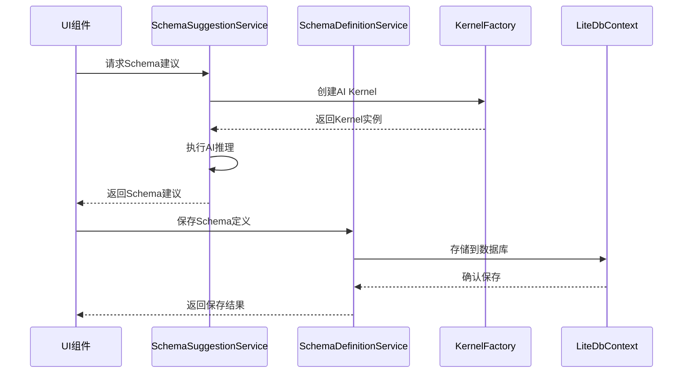
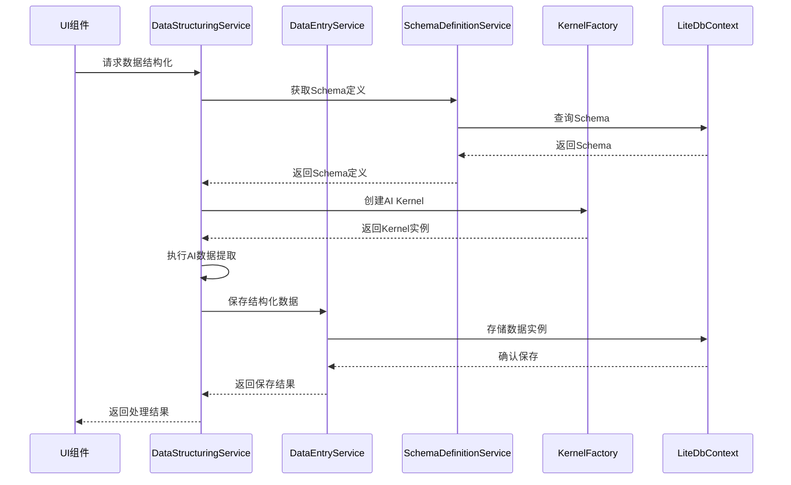
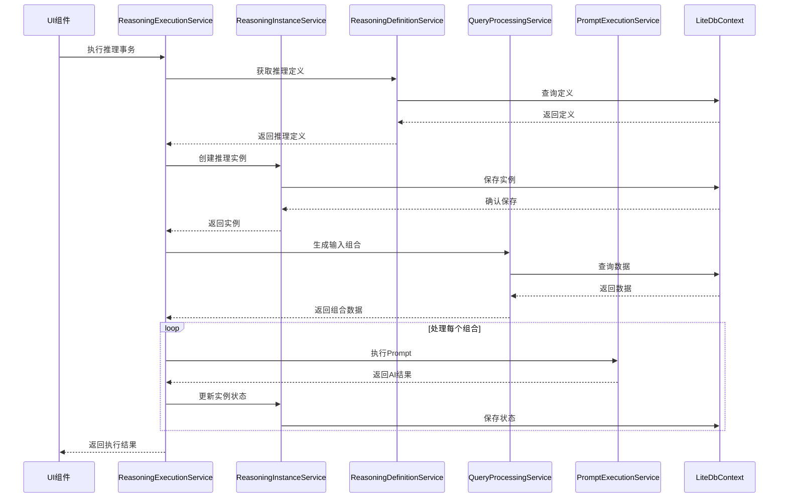

# ContentEngine 服务依赖关系图

## 整体架构依赖图

```mermaid
graph TB
    subgraph "UI层 - ContentEngine.WebApp"
        UI[Blazor Components]
        Pages[Pages & Components]
    end

    subgraph "AI应用服务层 - ContentEngine.Core.AI"
        SchemaSuggestion[ISchemaSuggestionService]
        DataStructuring[IDataStructuringService]
        PromptExecution[PromptExecutionService]
    end

    subgraph "核心业务层 - ContentEngine.Core"
        subgraph "DataPipeline模块"
            SchemaService[ISchemaDefinitionService]
            DataService[IDataEntryService]
            FileService[IFileConversionService]
        end
        
        subgraph "Inference模块"
            ReasoningDef[IReasoningDefinitionService]
            ReasoningInst[IReasoningInstanceService]
            ReasoningExec[IReasoningExecutionService]
            ReasoningEst[IReasoningEstimationService]
            ReasoningComb[IReasoningCombinationService]
            QueryProc[IQueryProcessingService]
            PromptInterface[IPromptExecutionService]
        end
        
        subgraph "Storage模块"
            LiteDB[LiteDbContext]
        end
    end

    subgraph "AI基础设施层 - ConfigurableAIProvider"
        KernelFactory[IAIKernelFactory]
        ConnectionProvider[IConnectionProvider]
        ModelProvider[IModelProvider]
        AgentLoader[IAgentConfigLoader]
        ServiceConfigurators[IAIServiceConfigurator集合]
    end

    %% UI层依赖
    UI --> SchemaSuggestion
    UI --> DataStructuring
    UI --> SchemaService
    UI --> DataService
    UI --> FileService
    UI --> ReasoningDef
    UI --> ReasoningInst
    UI --> ReasoningExec

    %% AI应用服务层依赖
    SchemaSuggestion --> KernelFactory
    DataStructuring --> KernelFactory
    PromptExecution --> KernelFactory
    PromptExecution --> PromptInterface

    %% 核心业务层内部依赖
    SchemaService --> LiteDB
    DataService --> LiteDB
    DataService --> SchemaService
    
    ReasoningDef --> LiteDB
    ReasoningInst --> LiteDB
    ReasoningInst --> ReasoningDef
    ReasoningExec --> ReasoningInst
    ReasoningExec --> ReasoningDef
    ReasoningExec --> QueryProc
    ReasoningExec --> PromptInterface
    ReasoningEst --> ReasoningDef
    ReasoningEst --> QueryProc
    ReasoningComb --> ReasoningDef
    ReasoningComb --> QueryProc
    ReasoningComb --> PromptInterface
    QueryProc --> LiteDB
    QueryProc --> SchemaService

    %% AI基础设施层内部依赖
    KernelFactory --> ConnectionProvider
    KernelFactory --> ModelProvider
    KernelFactory --> AgentLoader
    KernelFactory --> ServiceConfigurators

    %% 样式定义
    classDef uiLayer fill:#e1f5fe
    classDef aiAppLayer fill:#f3e5f5
    classDef coreLayer fill:#e8f5e8
    classDef infraLayer fill:#fff3e0
    
    class UI,Pages uiLayer
    class SchemaSuggestion,DataStructuring,PromptExecution aiAppLayer
    class SchemaService,DataService,FileService,ReasoningDef,ReasoningInst,ReasoningExec,ReasoningEst,ReasoningComb,QueryProc,PromptInterface,LiteDB coreLayer
    class KernelFactory,ConnectionProvider,ModelProvider,AgentLoader,ServiceConfigurators infraLayer
```



## 服务调用链路图

### Schema管理调用链


### 数据结构化调用链


### 推理事务执行调用链


## 模块间接口依赖

### 接口依赖矩阵

| 服务模块 | 依赖的接口 | 提供的接口 |
|---------|-----------|-----------|
| **UI层** | 所有业务服务接口 | - |
| **SchemaSuggestionService** | `IAIKernelFactory` | `ISchemaSuggestionService` |
| **DataStructuringService** | `IAIKernelFactory` | `IDataStructuringService` |
| **PromptExecutionService** | `IAIKernelFactory` | `IPromptExecutionService` |
| **SchemaDefinitionService** | `LiteDbContext` | `ISchemaDefinitionService` |
| **DataEntryService** | `LiteDbContext`, `ISchemaDefinitionService` | `IDataEntryService` |
| **ReasoningDefinitionService** | `LiteDbContext` | `IReasoningDefinitionService` |
| **ReasoningInstanceService** | `LiteDbContext`, `IReasoningDefinitionService` | `IReasoningInstanceService` |
| **ReasoningExecutionService** | `IReasoningInstanceService`, `IQueryProcessingService`, `IPromptExecutionService` | `IReasoningExecutionService` |
| **QueryProcessingService** | `LiteDbContext`, `ISchemaDefinitionService` | `IQueryProcessingService` |
| **KernelFactory** | `IConnectionProvider`, `IModelProvider`, `IAgentConfigLoader` | `IAIKernelFactory` |

## 循环依赖检查

### 当前架构无循环依赖
✅ **验证结果**：当前架构设计中不存在循环依赖

### 依赖层次
1. **第1层**：`LiteDbContext`, `IConnectionProvider`, `IModelProvider`, `IAgentConfigLoader`
2. **第2层**：`IAIKernelFactory`, `ISchemaDefinitionService`
3. **第3层**：`IPromptExecutionService`, `IDataEntryService`, `IReasoningDefinitionService`
4. **第4层**：`ISchemaSuggestionService`, `IDataStructuringService`, `IReasoningInstanceService`, `IQueryProcessingService`
5. **第5层**：`IReasoningExecutionService`, `IReasoningEstimationService`, `IReasoningCombinationService`
6. **第6层**：UI组件

## 服务注册顺序

基于依赖关系，推荐的服务注册顺序：

```csharp
// 1. 基础设施层
builder.Services.AddSingleton<LiteDbContext>();
builder.Services.AddConfigurableAIProvider(builder.Configuration);

// 2. 核心服务层
builder.Services.AddScoped<ISchemaDefinitionService, SchemaDefinitionService>();
builder.Services.AddHttpClient<IFileConversionService, FileConversionService>();

// 3. 数据服务层
builder.Services.AddScoped<IDataEntryService, DataEntryService>();

// 4. AI应用服务层
builder.Services.AddScoped<ISchemaSuggestionService, SchemaSuggestionService>();
builder.Services.AddScoped<IDataStructuringService, DataStructuringService>();
builder.Services.AddScoped<IPromptExecutionService, PromptExecutionService>();

// 5. 推理服务层
builder.Services.AddInferenceServices();
```

## 扩展点识别

### 主要扩展点
1. **新AI提供商**：实现`IAIServiceConfigurator`接口
2. **新数据源**：扩展`IFileConversionService`
3. **新推理策略**：扩展`IReasoningExecutionService`
4. **新预估算法**：扩展`IReasoningEstimationService`
5. **新UI组件**：基于现有服务接口构建

### 扩展影响分析
- **低影响**：新增AI提供商、新增数据源类型
- **中等影响**：新增推理策略、新增预估算法
- **高影响**：修改核心数据模型、修改基础接口

这个依赖关系图清晰地展示了ContentEngine项目中各服务间的依赖关系，有助于理解系统架构和进行后续的开发维护工作。 