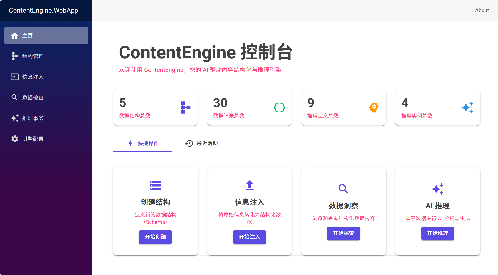
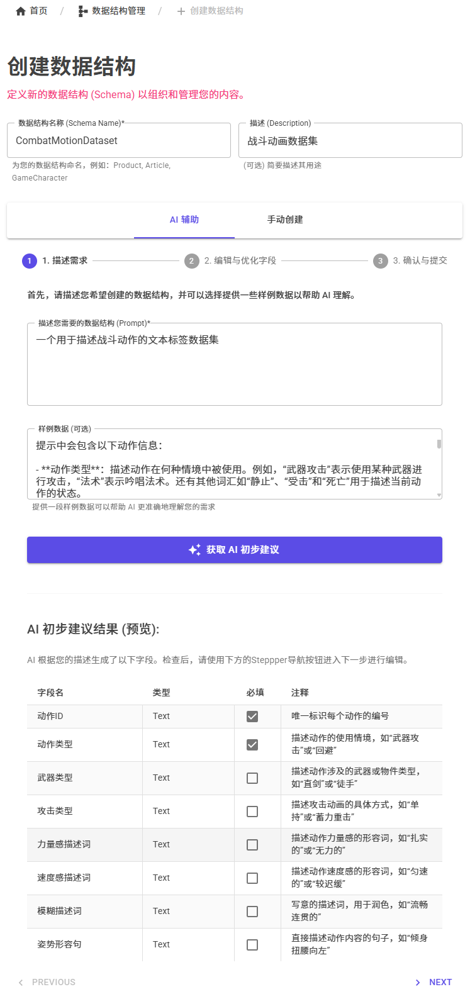
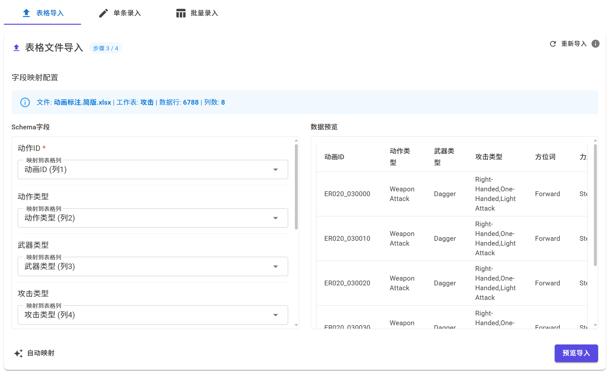
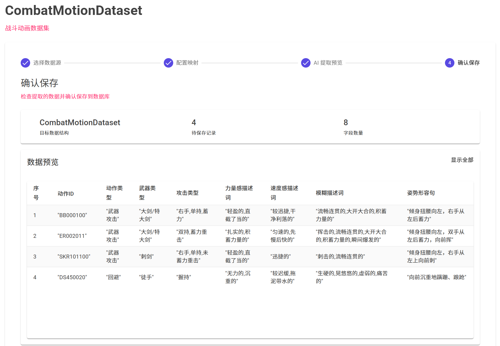
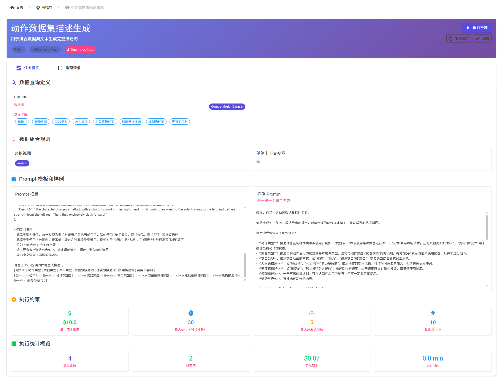
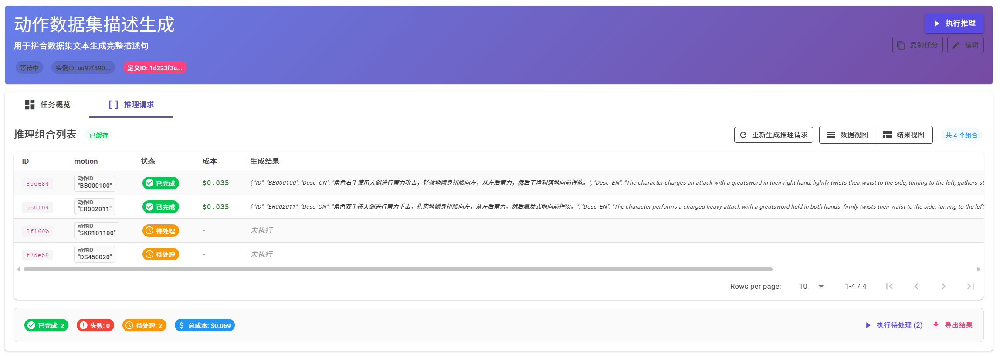

# ContentEngine - AI 驱动的内容结构化与推理引擎

[](https://dotnet.microsoft.com/)
[](https://blazor.net/)

> 一个利用 AI 对非结构化数据进行理解、结构化处理、存储和推理的引擎，旨在自动化生成丰富、动态且具备涌现性的内容，尤其适用于游戏开发等创意领域。
>
> 基于 Cursor、v0 等 Vibe Coding 应用开发
> 
> 显然他们对 Blazor 下的审美认知相对有限

[English](./README-EN.md) | **简体中文**

---

## 📖 项目概述

ContentEngine 是一个现代化的 AI 驱动内容管理控制台应用，通过结构化信息并进行智能推理，实现自动化内容创建和管理。项目采用 .NET 8 + Blazor Server 架构，提供直观的 Web 界面和强大的 AI 集成能力。



### 🎯 核心理念

我们相信，通过 AI 对信息进行深度结构化，并在此基础上进行洞察推理，可以：

- **🤖 自动化内容创建**: 从原始数据（文本、图片、文档等）中自动提取和组织关键信息
- **📊 实现定向信息管理**: 基于结构化数据建立索引和关联，方便查询和管理
- **✨ 驱动涌现式体验**: 通过 AI 推理不同结构化数据间的关系和交互，生成超越手工限制的丰富行为和内容

---

## 🚀 核心功能

### ⚙️ 灵活的 AI 配置

提供了一套易于复用的 Dotnet 下 AI 服务方案 ConfigurableAIProvider

- **多 AI 服务支持**: OpenAI、Azure OpenAI、Ollama、OpenRouter 等
- **配置文件管理**: 通过 YAML 文件管理连接和模型配置
- **Agent 系统**: 预定义的专用 AI 代理，针对不同任务优化
- **插件架构**: 支持自定义 AI 插件扩展

### 📝 智能数据录入 (Data Entry)
- **AI 辅助录入**: 上传文档或图片，AI 自动提取并填充结构化数据
- **手动录入界面**: 基于 Schema 自动生成的表单界面
- **批量数据处理**: 支持批量上传和处理多个数据源
- **数据验证**: 实时验证数据完整性和格式正确性


### 🧠 AI 推理引擎 (AI Inference)
- **推理任务定义**: 可视化定义推理逻辑和数据组合规则
- **多模型支持**: 集成 OpenAI、Azure OpenAI、本地模型等多种 AI 服务
- **批量推理执行**: 支持大规模数据的批量 AI 处理
- **结果管理**: 推理结果的存储、查看和后处理

---

## 🏗️ 技术架构

### 后端架构
```
ContentEngine.WebApp (Blazor Server UI)
├── ContentEngine.Core (核心业务逻辑)
│   ├── DataPipeline (数据管道)
│   ├── Inference (推理引擎)
│   └── Storage (数据存储)
├── ContentEngine.Core.AI (AI 应用层)
└── ConfigurableAIProvider (AI 服务层)
```

### 前端选择
- **主要界面**: Blazor Server + MudBlazor UI 组件库

### 数据存储
- **主数据库**: LiteDB (轻量级 NoSQL 数据库)
- **配置管理**: YAML 配置文件
- **文件存储**: 本地文件系统

### AI 集成
- **多服务支持**: OpenAI、Azure OpenAI、Ollama、OpenRouter 等
- **统一抽象**: 通过 ConfigurableAIProvider 提供统一的 AI 服务接口
- **灵活配置**: 支持运行时切换不同的 AI 服务和模型

---

## 🛠️ 快速开始

### 环境要求
- .NET 8.0 SDK
- Visual Studio 2022 或 VS Code

### 安装步骤

1. **克隆项目**
   ```bash
   git clone https://github.com/syan2018/ContentEngine.git
   cd ContentEngine
   ```

2. **配置 AI 服务**
   ```bash
   # 复制配置模板
   cp Profiles/connections.yaml Profiles/connections.dev.yaml
   
   # 编辑配置文件，填入你的 API 密钥
   # 支持的服务: OpenAI, Azure OpenAI, Ollama, OpenRouter 等
   ```

3. **启动应用**
   ```bash
   # 启动 Blazor Server 应用
   cd src/ContentEngine.WebApp
   dotnet run
   ```

   如果需要文件处理服务，参考 [MarkItDownAPI](./SupportServices/MarkItDown/README.md) 运行 FastAPI 项目提供文件处理支持

4. **访问应用**
   
   访问 http://localhost:5264/


---

## 📚 使用指南

以在另一个坑 [fyyakaxyy/AnimationGPT](https://github.com/fyyakaxyy/AnimationGPT) 中的实现过的数据处理流程为例（当时还需要 Python 硬搓），未使用组合叉积推理，仅简单示例基本流程

### 1. 创建数据结构 (Schema)
1. 访问 "数据结构管理" 页面
2. 点击 "创建新结构" 按钮
3. （可选在AI的协助下）定义字段名称、类型和约束
4. 保存并激活结构




### 2. 录入数据
1. 选择目标数据结构
2. 选择录入方式：
   - **智能导入**: 上传文档/网页/文本需求，AI 自动提取信息
   - **人工导入**: 通过导入表格映射实现快速录入，或手动录入
3. 验证并保存数据

手动批量导入表格数据



基于非结构化文本，AI自动识别




### 3. 配置 AI 推理任务
1. 访问 "AI 推理" 页面
2. 创建新的推理任务
3. 定义数据查询条件和组合规则
4. 配置 Prompt 模板和输出格式
5. 执行推理任务并查看结果






---

## 🎮 应用场景

### 内容生成
- **角色设定管理**: 从简单描述生成完整的角色卡片
- **NPC 行为推理**: 根据角色特征和环境生成动态行为模式
- **对话内容生成**: 基于上下文和角色特征生成自然的 NPC 对话


### 知识管理
- **文档结构化**: 将非结构化文档转换为结构化知识库
- **智能问答**: 提供结构化知识的RAG接口（TODO）

---

## 🔧 开发指南

### 项目结构
```
ContentEngine/
├── src/                          # 源代码
│   ├── ContentEngine.WebApp/     # Blazor Server 应用
│   ├── ContentEngine.Core/       # 核心业务逻辑
│   ├── ContentEngine.Core.AI/    # AI 应用层
│   └── ConfigurableAIProvider/   # AI 服务层
├── Profiles/                     # 配置文件
│   ├── connections.dev.yaml     # AI 服务连接配置
│   ├── models.yaml              # AI 模型配置
│   └── Agents/                  # AI 代理配置
├── Docs/                        # 项目文档
└── SupportServices/             # 支持服务
```

### TODO
1. **推理服务优化**: 断点继续推理相关功能测试、支持 Batch 推理减少 Token 消耗
2. **推理模板优化**: 支持通过模板快捷定义推理输出格式，约束使用 Json 结构输出复杂对象
3. **推理输出优化**: 支持自定义数据结构的推理结果收集和导出
4. **数据结构支持拓展**: 支持枚举等数据结构，优化部分场景
5. **嵌入功能拓展**: 拓展数据项支持 RAG ，支持提供知识管理服务，同时支持更灵活的推理组合
6. **数据浏览优化**: 可视化和查询相关
7. **整理与重构**: 受限于 Vibe Coding 上下文，部分代码

当前由于没有明确进一步需求驱动，可能会暂时搁置TODO项开新坑。如果有清晰的使用需求，欢迎联系作者拓展（或者尝试使用cursor开发并贡献项目！）


<div align="center">

**⭐ 如果这个项目对你有帮助，请给我们一个 Star！**

*让 AI 赋能你的创意，让内容创作更加智能化！*

</div>
